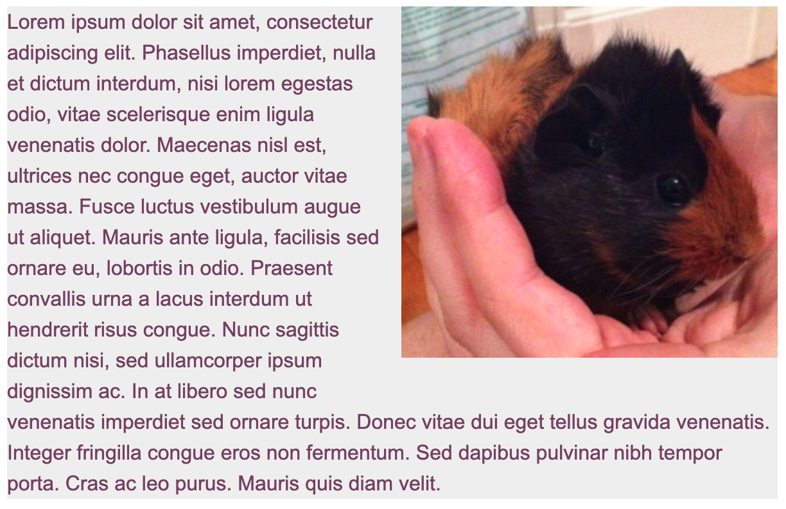
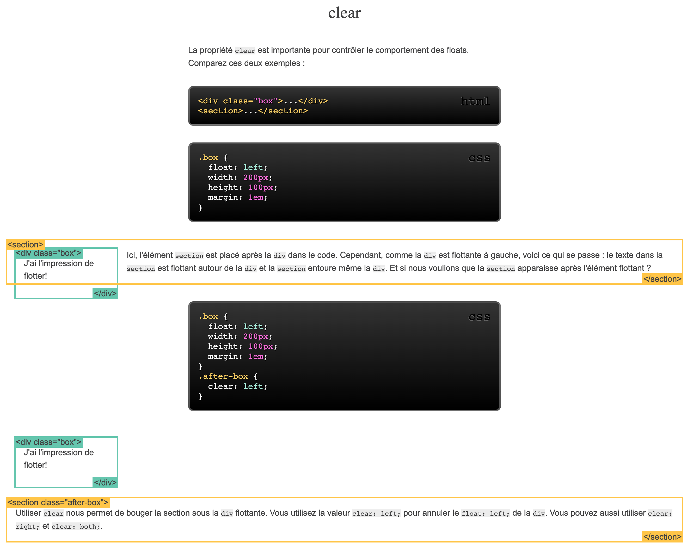
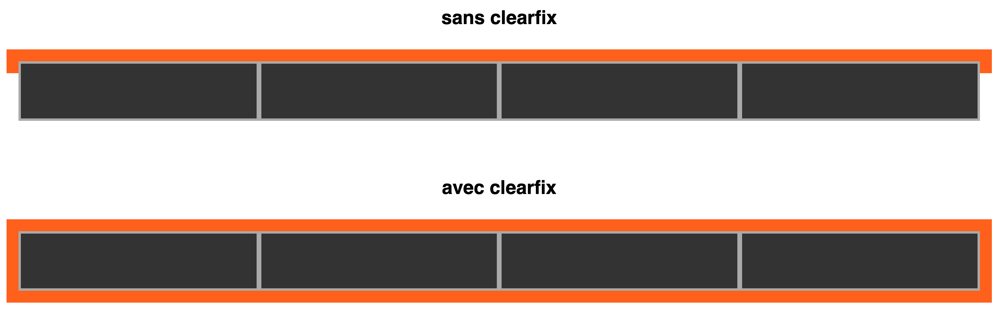

# Float et clear

Les techniques `float` et `clear` sont utilisées en CSS pour contrôler la mise en page et le comportement des éléments lorsque vous avez besoin de les faire flotter à gauche ou à droite, généralement pour créer des mises en page avec des éléments côte à côte, comme des colonnes.

**1. La propriété `float` :**

La propriété `float` est utilisée pour déplacer un élément vers la gauche ou la droite de son conteneur, ce qui lui permet de flotter à côté d'autres éléments. Les valeurs courantes pour `float` sont `left` (à gauche) et `right` (à droite).

Exemple :

```html
<div class="box">...</div>
<section>...</section>
```

```css
.box {
  float: right;
  width: 200px;
  height: 100px;
  margin: 1em;
}
```



Dans cet exemple, une boite flottante est créée, à droite, elle occupe 200px de large. Cela permet aux texte de s'aligner côte à côte de la boite flottante.

**2. La propriété `clear` :**

La propriété `clear` est utilisée pour spécifier de quel côté un élément ne doit pas être autorisé à flotter. Cela permet d'empêcher un élément de passer à côté d'autres éléments flottants précédents.

```css
.box {
  float: left;
  width: 200px;
  height: 100px;
  margin: 1em;
}
.after-box {
  clear: left;
}
```



Utiliser `clear` nous permet de bouger la section sous la `div` flottante. Vous utilisez la valeur `clear: left;` pour annuler le `float: left;` de la `div`. Vous pouvez aussi utiliser `clear: right;` et `clear: both;`.

Exemple classique d'une classe utilitaire pour reset les float :

> [voir exemple ici](https://codepen.io/benoitwimart/pen/mrbRYJ)

```css
.clearfix::after {
    content: "";
    display: block;
    clear: both;
}
```



Dans cet exemple, une classe `.clearfix` est utilisée pour nettoyer les éléments flottants à l'intérieur de son conteneur. La pseudo-classe `::after` est utilisée pour ajouter un élément vide à la fin du conteneur avec `clear: both;`, ce qui garantit que l'élément `.clearfix` ne sera pas influencé par les éléments flottants précédents.

Utiliser `float` et `clear` peut être utile pour créer des mises en page complexes, mais il est important de noter que ces techniques peuvent causer des problèmes de mise en page si elles ne sont pas utilisées correctement.
D'autre part, avec les navigateur moderne et l'avènement de la norme CSS3, il est recommandé d'utiliser des techniques de mise en page modernes, telles que Flexbox et Grid, chaque fois que cela est possible, car elles offrent un meilleur contrôle sur la mise en page et sont plus prédictibles.

> Pour aller plus loin avec le float et le clear, voir ces exemples:

- [float](https://fr.learnlayout.com/float)
- [clear](https://fr.learnlayout.com/clear)
- [clearfix](https://fr.learnlayout.com/clearfix)
- [exemple de float layout](https://fr.learnlayout.com/float-layout)
