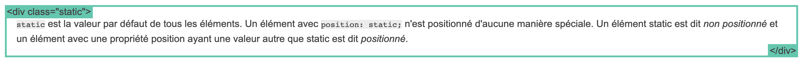
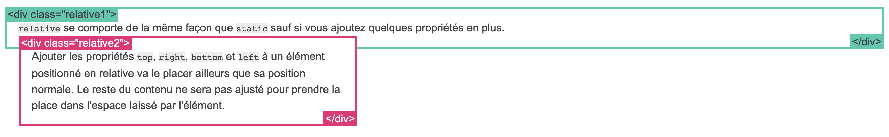
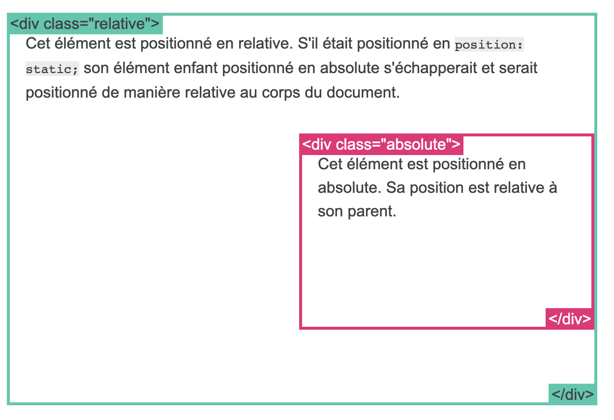
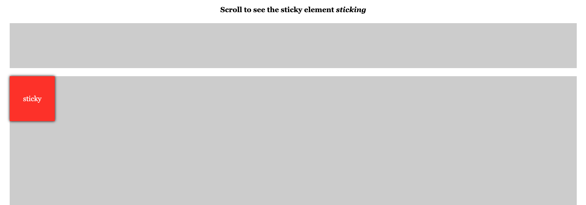
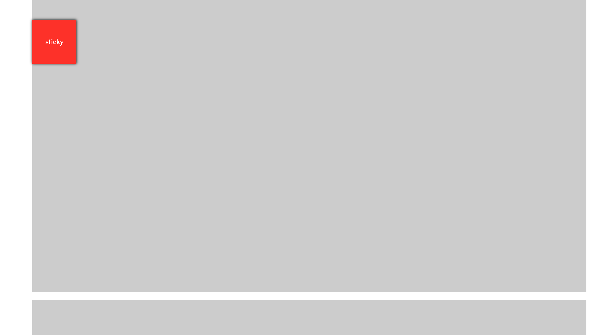

# Positionnement et calques

Le positionnement en CSS détermine comment un élément est placé par rapport à ses éléments parents ou à la fenêtre du navigateur. Il existe plusieurs valeurs de positionnement, chacune ayant son propre comportement.
C'est un outil très puissant pour générer des mise en pages complexes avec des éléments qui se supperposent.

1. **Position `static`** :
   - La position `static` est la valeur par défaut pour tous les éléments HTML.
   - Les éléments avec une position `static` sont positionnés en fonction de l'ordre normal du flux du document.
   - Les propriétés `top`, `right`, `bottom`, et `left` n'ont pas d'effet sur les éléments en position `static`.

   Exemple :

   ```css
   .element {
       position: static;
   }
   ```

   

2. **Position `relative`** :

   - La position `relative` positionne un élément par rapport à sa position normale dans le flux du document.
   - Vous pouvez utiliser les propriétés `top`, `right`, `bottom`, et `left` pour déplacer l'élément par rapport à sa position normale.

   Exemple :

   ```css
   .element {
       position: relative;
       top: 20px;
       left: 10px;
   }
   ```
  
  

3. **Position `absolute`** :

   - La position `absolute` positionne un élément par rapport à son parent le plus proche qui a une position autre que `static` (généralement `relative`, `absolute`, ou `fixed`).
   - Si aucun parent ne remplit ces conditions, l'élément sera positionné par rapport au document lui-même.
   - Les propriétés `top`, `right`, `bottom`, et `left` sont utilisées pour spécifier la position.

   Exemple :

   ```css
   .element {
       position: absolute;
       top: 50px;
       left: 100px;
   }
   ```

   

4. **Position `fixed`** :

   - La position `fixed` positionne un élément par rapport à la fenêtre du navigateur, ce qui signifie qu'il reste fixe même lorsque vous faites défiler la page.
   - Vous pouvez utiliser les propriétés `top`, `right`, `bottom`, et `left` pour spécifier la position.

   Exemple :

   ```css
   .element {
       position: fixed;
       top: 10px;
       right: 10px;
   }
   ```

   

5. **Position `sticky`** :

   - La position `sticky` est une combinaison de `relative` et `fixed`.
   - L'élément est positionné en fonction de la position normale dans le flux du document jusqu'à ce qu'il atteigne un point de défilement spécifié, après quoi il se comporte comme un élément `fixed`.
   - Vous devez définir une valeur de `top`, `right`, `bottom`, ou `left` pour indiquer le point de défilement.

   Exemple :

   ```css
   .element {
       position: sticky;
       top: 20px;
   }
   ```

   > [voir l'exemple de code ici](https://codepen.io/rpsthecoder/pen/zGYXEX)

   

   En scrollant, le div reste accroché au haut de la page :

   

### à retenir

> Par défaut, tous les élements ont une positon `static`.
> Pour qu'un élément **B** soit positionné par rapport à un autre élément parent **A**, cet élément parent **A**, doit lui-même être positionné avec une valeur différente de `static`.
> Si aucun élément parent de **B** n'est positionné (`relative`, `absolute` ou `sticky`) celui-ci se positionne par rapport au document, c'est à dire la fenêtre.

## Flux de la page et le Z-index

Le flux de la page (le flux normal des éléments HTML) et le `z-index` sont deux concepts importants en CSS et en HTML qui déterminent comment les éléments sont empilés et affichés sur une page web.

### 1. Le Flux de la Page (Flow of the Page)

Le flux de la page décrit comment les éléments HTML sont affichés dans un ordre linéaire, du haut vers le bas, à moins que vous n'interveniez avec des propriétés de positionnement CSS. Par défaut, les éléments sont empilés dans l'ordre où ils apparaissent dans le code HTML. Par exemple, si vous avez deux paragraphes `<p>` l'un après l'autre, le premier apparaîtra au-dessus du second dans le flux normal.

Voici un exemple simple du flux de la page :

```html
<!DOCTYPE html>
<html lang="fr">
<head>
    <meta charset="UTF-8">
    <meta name="viewport" content="width=device-width, initial-scale=1.0">
    <title>Exemple de Flux de la Page</title>
    <style>
        p {
            margin: 10px;
            padding: 10px;
            background-color: #f0f0f0;
        }
    </style>
</head>
<body>
    <p>Paragraphe 1</p>
    <p>Paragraphe 2</p>
</body>
</html>
```

Dans cet exemple, les deux paragraphes sont empilés l'un sur l'autre dans l'ordre où ils apparaissent dans le code HTML. Mais ces éléments ont une "profondeur" de rendu.
Ainsi, si vous placez une marge négative sur le second paragraphe, il va venir se supperposer et recouvrir le premier paragraphe. Dans le flux de la page, le deuxième paragraphe a été créé après le premier, ce qui lui confère une profondeur suppérieure.

Voici un exemple simple du flux de la page avec des marges négatives :

```html
<!DOCTYPE html>
<html lang="fr">
<head>
    <meta charset="UTF-8">
    <meta name="viewport" content="width=device-width, initial-scale=1.0">
    <title>Exemple de Flux de la Page</title>
    <style>
        p {
            margin: 10px;
            padding: 10px;
            display: block;
            background-color: #f0f0f0;
        }

        p + p {
          margin-top: -42px; /* on décale le deuxième paragraphe vers le haut avec cette marge négative */
          font-weight: bold;
          color: red;
          background-color: #c1e798;
        }
    </style>
</head>
<body>
    <p>Paragraphe 1</p>
    <p>Paragraphe 2</p>
</body>
</html>
```

Voici un exemple simple du flux de la page :

```html
<!DOCTYPE html>
<html lang="fr">
<head>
    <meta charset="UTF-8">
    <meta name="viewport" content="width=device-width, initial-scale=1.0">
    <title>Exemple de Flux de la Page</title>
    <style>
        p {
            margin: 10px;
            padding: 10px;
            background-color: #f0f0f0;
        }
    </style>
</head>
<body>
    <p>Paragraphe 1</p>
    <p>Paragraphe 2</p>
</body>
</html>
```

Dans cet exemple, les deux paragraphes sont empilés l'un sur l'autre dans l'ordre où ils apparaissent dans le code HTML.

### 2. le `z-index`

Le `z-index` est une propriété CSS qui contrôle la pile d'éléments en termes de profondeur ou de superposition sur la page web. Les éléments avec un `z-index` plus élevé seront placés au-dessus des éléments avec un `z-index` plus bas. Cependant, pour que la propriété `z-index` fonctionne, l'élément doit également avoir une position différente de la valeur par défaut `static`.

Voici un exemple d'utilisation du `z-index` :

```html
<!DOCTYPE html>
<html lang="fr">
<head>
    <meta charset="UTF-8">
    <meta name="viewport" content="width=device-width, initial-scale=1.0">
    <title>Exemple de z-index</title>
    <style>
        .box1 {
            position: absolute;
            top: 50px;
            left: 50px;
            width: 100px;
            height: 100px;
            background-color: #ff0000;
            z-index: 2;
        }

        .box2 {
            position: absolute;
            top: 80px;
            left: 80px;
            width: 100px;
            height: 100px;
            background-color: #00ff00;
            z-index: 1;
        }
    </style>
</head>
<body>
    <div class="box1"></div>
    <div class="box2"></div>
</body>
</html>
```

Dans cet exemple, deux boîtes (`box1` et `box2`) sont positionnées à l'aide de `position: absolute;` et ont des valeurs de `z-index` différentes. La boîte `box1` a un `z-index` plus élevé, donc elle apparaîtra au-dessus de la boîte `box2`. Cela illustre comment le `z-index` permet de contrôler la superposition des éléments, même s'ils ont des positions différentes.

## propriété overflow

La propriété CSS `overflow` est utilisée pour contrôler le comportement de débordement du contenu d'un élément lorsque celui-ci dépasse les dimensions de l'élément parent. Elle est couramment utilisée pour gérer les débordements de contenu dans des éléments tels que des boîtes, des divs, des cadres, etc. La propriété `overflow` peut prendre plusieurs valeurs pour déterminer comment gérer le débordement.

Voici les valeurs possibles pour la propriété `overflow` :

1. `visible` (par défaut) : Cela signifie que le contenu peut déborder de l'élément parent sans aucune restriction, ce qui peut provoquer l'affichage du contenu dépassant de la zone parente.

2. `hidden` : Tout le contenu qui dépasse les dimensions de l'élément parent sera masqué et ne sera pas visible.

3. `scroll` : Des barres de défilement (horizontales et verticales) sont ajoutées à l'élément parent, permettant à l'utilisateur de faire défiler le contenu excédentaire. On peut aussi utilsier `scroll-x` et `scroll-y` pour être plus spécifique.

4. `auto` : Des barres de défilement sont ajoutées uniquement lorsque le contenu dépasse les dimensions de l'élément parent. Si le contenu n'est pas plus grand que l'élément parent, aucune barre de défilement n'apparaîtra.

Exemple :

```css
.container {
    width: 200px; /* Largeur de la boîte parente */
    height: 200px; /* Hauteur de la boîte parente */
    overflow: scroll; /* Ajoute des barres de défilement en cas de débordement */
    border: 1px solid #ccc;
}

.content {
    width: 300px; /* Largeur du contenu dépassant la boîte parente */
    height: 300px; /* Hauteur du contenu dépassant la boîte parente */
    background-color: #007bff;
}
```

```html
<div class="container">
    <div class="content"></div>
</div>
```

Dans cet exemple, nous avons une boîte parente (`.container`) avec une largeur et une hauteur définies. À l'intérieur de cette boîte, nous avons un contenu (`.content`) qui dépasse les dimensions de la boîte parente. En appliquant `overflow: scroll;` à la boîte parente, des barres de défilement sont ajoutées, permettant à l'utilisateur de faire défiler le contenu excédentaire à l'intérieur de la boîte parente.

Cela vous donne un contrôle précis sur la gestion des débordements de contenu, que ce soit en masquant le contenu, en affichant des barres de défilement, ou en laissant le contenu se déborder librement.

### utilisation typique du `overflow: hidden`

Vous pouvez utiliser la pseudo-classe `:hover` en CSS pour afficher un élément caché lorsqu'un utilisateur survole un élément parent. Voici un exemple d'utilisation de `overflow: hidden;` avec un élément caché qui apparaît au survol de la souris :

```css
.container {
    width: 200px; /* Largeur de la boîte parente */
    height: 200px; /* Hauteur de la boîte parente */
    overflow: hidden; /* Masque le contenu qui dépasse */
    border: 1px solid #ccc;
    position: relative; /* Nécessaire pour le positionnement de l'élément caché */
}

.content {
    width: 300px; /* Largeur du contenu dépassant la boîte parente */
    height: 300px; /* Hauteur du contenu dépassant la boîte parente */
    background-color: #007bff;
    position: absolute; /* Position absolue par rapport à la boîte parente */
    bottom: -300px;  /* Masque l'élément en dehors de la boîte parente */
    left: 0; /* Place l'élément à gauche de la boîte parente */
    opacity: 0; /* Fait apparaître l'élément au survol */
    transition: all 0.3s; /* Ajoute une animation de transition */
}

/* réaction au survol */
.container:hover .content {
    opacity: 1; /* Fait apparaître l'élément au survol */
    bottom: 0; /* Positionne l'élément à sa position initiale pour être visible */
}
```

```html
<div class="container">
    <div class="content"></div>
</div>
```

Dans cet exemple, nous avons une boîte parente (`.container`) avec `overflow: hidden;`, ce qui signifie que tout contenu qui dépasse sera masqué. À l'intérieur de la boîte parente, nous avons un élément caché (`.content`) positionné en dehors de la boîte parente à l'aide de `left: -100px;`. L'opacité de l'élément caché est réglée sur 0, ce qui le rend invisible au départ.

Lorsque l'utilisateur survole la boîte parente (`.container`), nous utilisons la règle `.container:hover .content` pour faire apparaître l'élément caché en ajustant l'opacité à 1 et en le positionnant à sa position initiale (`left: 0;`). Une transition en douceur est ajoutée pour un effet d'apparition en douceur.

Ainsi, au survol de la souris, l'élément caché devient visible à l'intérieur de la boîte parente.

> Pour aller plus loin avec le z-index et le positionnement voir ces exemples

- [position](https://fr.learnlayout.com/position)
- [exemple avec position](https://fr.learnlayout.com/position-example>)
- [exemple position sticky](https://codepen.io/rpsthecoder/pen/zGYXEX)
