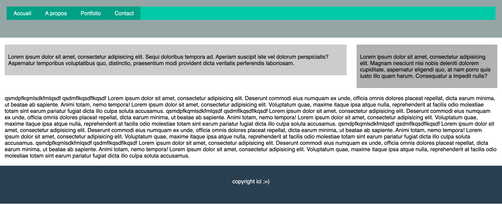

# Exercice 11 : float

D'après l'exemple suivant :

- réaliser un layout avec les propriétés CSS: `float`, `display`, `clear`
- créer un header avec la balise `<header></header>`
- dans le header, créer une `<nav>` avec un `<ul>` et 4 `<li>` contenant des liens `<a>` lien 1, lien 2, lien 3 et lien 4.
- réaliser une navigation horizontale à l'aide de `float`
- sous le header ajouter une `<section></section>`
- contenu de la section : 
  - une balise `<article>contenu de votre choix</article>`
  - une balise `<aside>contenu de votre choix</aside>`
- sous la section ajouter un `<footer>contenu de votre choix</footer>`
- dans la section, l'article et l'aside doivent former 2 colonnes (flottant)
  - article: largeur 70%
  - aside: largeur 30%
- le header et le footer devront avoir la hauteur de 150px (avec une couleur d'arrière plan pour les distinguer).
