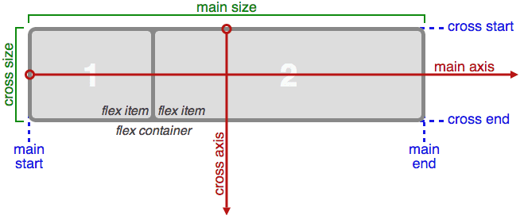
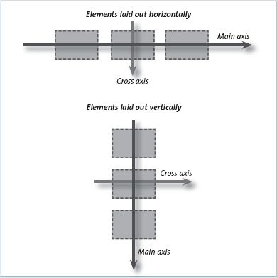

# Flexbox system

Flexbox est une technique de mise en page en CSS qui vous permet de créer des mises en page flexibles et réactives en alignant et en organisant facilement les éléments dans un conteneur.

## Le conteneur flex (parent)

**1. Le Conteneur Flex (`display: flex;`) :**

Pour utiliser Flexbox, vous devez d'abord déclarer un conteneur comme un conteneur flex en lui appliquant la propriété `display: flex;`. Cela active le modèle de mise en page flex pour les éléments enfants de ce conteneur.

Exemple :
```css
.container {
    display: flex;
}
```

**2. Les Éléments Enfants Flex (`flex-items`) :**

Une fois que vous avez un conteneur flex, ses enfants directs (les éléments à l'intérieur) deviennent automatiquement des éléments flexibles, également appelés "flex-items". Vous pouvez spécifier comment ces éléments doivent se comporter en termes d'espacement, d'alignement et de dimensionnement.

**3. L'Alignement des Éléments Flex :**

Flexbox vous permet de contrôler l'alignement des éléments flex dans deux axes principaux : l'axe principal (axe horizontal par défaut) et l'axe transversal (axe vertical par défaut). 
Vous pouvez utiliser les propriétés suivantes :

- `justify-content` : pour l'alignement le long de l'axe principal.
- `align-items` : pour l'alignement le long de l'axe transversal.

Exemple :

```css
.container {
    display: flex;
    justify-content: center; /* Centre les éléments sur l'axe principal */
    align-items: center; /* Centre les éléments sur l'axe secondaire */
}
```



**4. La Direction des Éléments Flex :**

Vous pouvez également spécifier la direction dans laquelle les éléments flex sont placés en utilisant la propriété `flex-direction`. Les valeurs courantes sont `row` (par défaut, de gauche à droite), `row-reverse` (de droite à gauche), `column` (de haut en bas), et `column-reverse` (de bas en haut).

Exemple :

```css
.container {
    display: flex;
    flex-direction: column; /* Aligne les éléments de haut en bas */
}
```

lorsque vous changez la direction du flex, l'axe pricipal et l'axe croisé sont inversé, **l'axe principal** devient alors **vertical** et **l'axe secondaire** devient **horizontal**.



L'utilisation des alignements est alors inversé :

```css
.container {
    display: flex;
    flex-direction: column; /* change la direction des axes */
    justify-content: center; /* Centre les éléments sur l'axe principal (donc maintenant vertical) */
    align-items: center; /* Centre les éléments sur l'axe secondaire donc maintenant horizontal */
}
```

**5. L'Espacement Entre les Éléments Flex :**

La propriété `gap` (ou `row-gap` et `column-gap` pour une meilleure prise en charge) vous permet de définir l'espacement entre les éléments flex.

Exemple :

```css
.container {
    display: flex;
    gap: 10px; /* Espacement de 10 pixels entre les éléments */
}
```

**6. La Répartition de l'Espace Libre :**

Flexbox vous permet de distribuer l'espace libre dans le conteneur en utilisant la propriété `flex`. Vous pouvez attribuer des valeurs flexibles aux éléments enfants pour contrôler la quantité d'espace qu'ils occupent.

Exemple :

```css
.item1 {
    flex: 1; /* Occupe tout l'espace disponible */
}

.item2 {
    flex: 2; /* Occupe deux fois plus d'espace que item1 */
}
```

Ces sont des concepts de base de Flexbox. En utilisant ces propriétés, vous pouvez créer des mises en page flexibles, réactives et élégantes pour vos sites web. Flexbox est particulièrement utile pour créer des éléments centrés, des barres de navigation, des galeries d'images et bien d'autres éléments de mise en page.

## Les éléments à l'intérieur du flex (children)

L'alignement des enfants dans un conteneur flex en utilisant Flexbox est basé sur les directives de l'élément parent, c'est à dire le conteneur qui a la propriété `display: flex;`.
On peut cependant contrôler l'alignement sur l'axe secondaire de chaque enfant à l'aide de `align-self`.

1. **Propriété `align-items` du Conteneur Flex :** La propriété `align-items` est appliquée au conteneur flex pour spécifier comment les éléments enfants doivent être alignés le long de l'axe transversal. Les valeurs courantes pour `align-items` incluent :

   - `flex-start` : Les éléments sont alignés en haut de l'axe transversal.
   - `flex-end` : Les éléments sont alignés en bas de l'axe transversal.
   - `center` : Les éléments sont centrés le long de l'axe transversal.
   - `baseline` : Les éléments sont alignés en fonction de leur ligne de base.
   - `stretch` : Les éléments sont étirés pour occuper toute la hauteur du conteneur (par défaut).

2. **Propriété `align-self` des Éléments Enfants :** La propriété `align-self` est appliquée à un/des élément(s) enfant(s) **spécifique(s)** pour contrôler leur alignement **individuellement** par rapport à l'alignement défini par `align-items` du conteneur. Cela permet d'ajuster l'alignement de certains éléments sans affecter les autres.

**Exemple d'utilisation de `align-self` :**

Considérons un exemple où nous avons trois éléments enfants dans un conteneur flex. Le conteneur a `align-items: center;` pour aligner les éléments au centre de l'axe transversal. Cependant, nous voulons que le deuxième élément soit aligné en haut plutôt qu'au centre. C'est là que `align-self` intervient.

```css
.container {
    display: flex;
    align-items: center; /* Centre les éléments sur l'axe secondaire (verticalement) */
    height: 200px;
    border: 1px solid #ccc;
}

.item {
    width: 100px;
    height: 100px;
    background-color: #007bff;
    margin: 10px;
}

.item2 {
    align-self: flex-start; /* Aligne cet élément spécifique en haut */
}
```

```html
<div class="container">
    <div class="item">1</div>
    <div class="item item2">2</div>
    <div class="item">3</div>
</div>
```

Dans cet exemple, l'élément avec la classe `.item2` utilise `align-self: flex-start;` pour remplacer l'alignement vertical par défaut défini par `align-items`. Les autres éléments suivent toujours l'alignement défini par le conteneur. Cela permet d'ajuster l'alignement des éléments individuellement.

> Pour aller plus loin avec flexbox :

- [La cascade](https://la-cascade.io/articles/flexbox-guide-complet)
- [Jeu pour mémoriser le flexbox](https://flexboxfroggy.com/#fr)
- [CSS Tricks Flexbox](https://css-tricks.com/snippets/css/a-guide-to-flexbox/)
- [MDN les flexbox](https://developer.mozilla.org/fr/docs/Learn/CSS/CSS_layout/Flexbox)