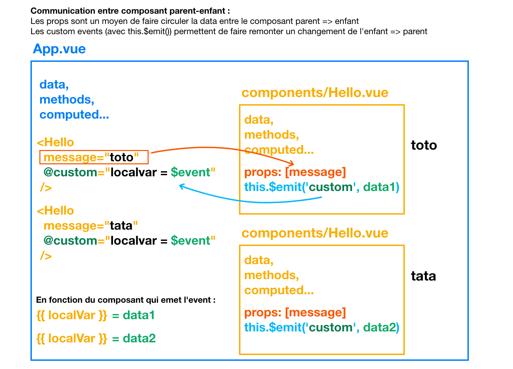

# Communication inter composants

Dans Vue.js, la communication entre les composants peut se faire de différentes manières, notamment en utilisant les props et les events.



## Utilisation des Props

Les props (propriétés) sont des attributs personnalisés que vous pouvez passer à un composant enfant pour lui transmettre des données. Les props sont définies dans l'élément parent et peuvent être utilisées dans l'élément enfant.

Exemple d'utilisation des props :

Dans le composant parent :

```js
  <template>
    <ChildComponent :message="parentMessage" />
  </template>

  <script>
  import ChildComponent from './ChildComponent.vue';

  export default {
    components: {
      ChildComponent
    },
    data() {
      return {
        parentMessage: 'Message du parent'
      };
    }
  };
  </script>
```

Dans le composant enfant (`ChildComponent.vue`) :

```js
  <template>
    <div>
      <p>{{ message }}</p>
    </div>
  </template>

  <script>
  export default {
    props: ['message']
  };
  </script>
```

Dans cet exemple, nous passons la valeur `parentMessage` du composant parent au composant enfant en utilisant la prop `message`. Le composant enfant peut alors utiliser cette prop pour afficher le message.

## Utilisation des Events

Les events sont utilisés pour permettre à un composant enfant de communiquer avec son parent. Un composant enfant peut émettre un event, et le composant parent peut écouter cet event et réagir en conséquence.

Exemple d'utilisation des events :

Dans le composant enfant (`ChildComponent.vue`) :

```js
  <template>
    <button @click="sendMessage">Envoyer un message au parent</button>
  </template>

  <script>
  export default {
    methods: {
      sendMessage() {
        this.$emit('message-sent', 'Message du composant enfant');
      }
    }
  };
  </script>
```

Dans le composant parent :

```js
  <template>
    <div>
      <ChildComponent @message-sent="handleMessage" />
      <p>Message reçu du composant enfant : {{ receivedMessage }}</p>
    </div>
  </template>

  <script>
  import ChildComponent from './ChildComponent.vue';

  export default {
    components: {
      ChildComponent
    },
    data() {
      return {
        receivedMessage: ''
      };
    },
    methods: {
      handleMessage(message) {
        this.receivedMessage = message;
      }
    }
  };
  </script>
```

Dans cet exemple, le composant enfant émet un event `message-sent` lorsque le bouton est cliqué. Le composant parent écoute cet event et exécute la méthode `handleMessage` en réponse. La méthode `handleMessage` reçoit le message envoyé par le composant enfant et le stocke dans la propriété `receivedMessage`, qui est ensuite affichée dans le template du composant parent.

## En conclusion

Les props et les events sont deux mécanismes clés pour permettre la communication entre les composants dans Vue.js. Les props sont utilisées pour passer des données du parent à l'enfant, tandis que les events sont utilisées pour permettre à un composant enfant de communiquer avec son parent. En combinant ces deux techniques, vous pouvez créer des architectures de composants flexibles et modulaires dans vos applications Vue.js.
