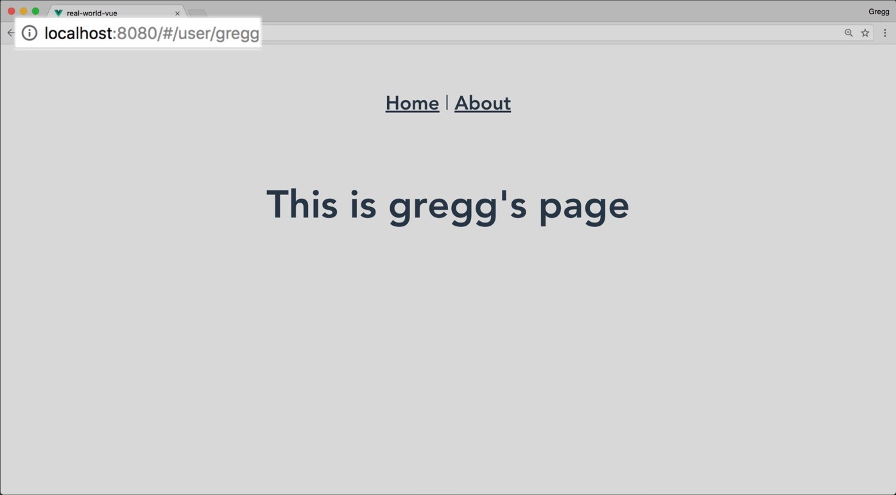

# Routes dynamiques & History Mode

Cette leçon aborde la création d'itinéraires dynamiques et comment utiliser le mode History HTML5 pour se débarrasser du sigle `#` dans l'URL.

## Créer une route dynamique

Souvent, lorsque la construction de sites Web, nous voulons créer des itinéraires qui contiennent des informations dynamiques, comme par exemple un nom d'utilisateur:  `/users/john` ou john est le nom d'un utilisateur, utilisé en tant que variable de chemin pour afficher les données propres à cet utilisateur en particulier.

Poru faire ça, il faut utiliser un nouveau paramètre dans notre route :

`router.js`

```js
    //...
    import User from './views/User.vue'
    Vue.use(Router)

    export default new Router({
      routes: [
        ...
        {
          path: '/user/:username', //<----- :username est une variable ici
          name: 'user',
          component: User
        }
      ]
    })
```

Pour tirer partie de cette nouvelle route, nous pouvons faire appel à ce nouveau paramètre du routeur dans nos templates :

`/pages/user.vue`

```vue
    <template>
      <div class="user">
        <h1>This is a page for {{ $route.params.username }}</h1>
      </div>
    </template>
```

L'objet `$route` représente l'état de la route active en cours. Il contient des données sur la route, y compris le paramère. Pour en savoir plus sur cet objet consultez la documentation de l'API.

Maintenant si l'on visite la route `/user/gregg`, nous devrions voir ça :



## Utiliser un paramètre dans un lien

Nous pouvons créer un lien vers des itinéraires dynamiques en plaçant les paramètres de nos liens:

```html
    <router-link :to="{ name: 'user', params: { username: 'gregg' }  }">Gregg</router-link>
```

### Utiliser Props pour les routes

Utiliser `$route.params` dans votre composant limite sa flexibilité. Une façon plus modulaire pour créer vos composants dynamiques est de passer le paramètre `props:true` dans la configuration de votre itinéraire.

`router/index.js`

```js
const router = createRouter({
    history: createWebHistory(import.meta.env.BASE_URL),
    routes: [
      //...
      {
        path: "/user/:username",
        name: "user",
        component: User,
        props: true
      },
      //...
    ]
})
```

Le `$route.params` sera ainsi envoyé à votre composant comme une `props` normale.
À l'intérieur de notre composant, il faut adapter le code pour recevoir l'information :

`User.vue`

```vue
    <template>
      <div class="user">
        <h1>{{ username }}</h1>
      </div>
    </template>

    <script>
    export default {
      props: ["username"]
    };
    </script>
```

Tout va fonctionner de la même façon, mais notre composant pourra aussi être réutilisé en tant que composants normal dans un autre contexte, en passant le nom d'utilisateur comme une `props` du composant.

## Differents modes "History"

Vous pouvez avoir plusieurs mode de navigation, pour palier à des situations différentes. Par défaut, nous utilisons le mode `createWebHistory`. Mais il en existe d'autres pour palier à différentes configuration de serveur. 
Ce mode par défaut est recommandé par HTML5, il indique à Vue d'utiliser l'API `history.pushState` du navigateur pour changer l'URL sans recharger la page.

### Cependant, cela peut soulever un problème :

Normalement, lorsque vous chargez `/about` sur un serveur, il rechercherait un dossier/fichier about.html.

C'est là que le bât blesse : Comme notre application est une application client à page unique, sans une configuration serveur appropriée, les utilisateurs obtiendront une erreur 404 s'ils accèdent à `https://example.com/about.html` directement dans leur navigateur.

Pour résoudre ce problème, tout ce que vous avez à faire est d'ajouter une route de secours à votre serveur. Si l'URL ne correspond à aucune ressource statique, elle doit servir la même page `index.html` que celle dans laquelle se trouve votre application.

Voici un exemple de configuration pour un serveur qui utilise Apache :

`.htaccess`

```sh
    <IfModule mod_rewrite.c>
        RewriteEngine On
        RewriteBase /
        RewriteRule ^index\.html$ - [L]
        RewriteCond %{REQUEST_FILENAME} !-f
        RewriteCond %{REQUEST_FILENAME} !-d
        RewriteRule . /index.html [L]
    </IfModule>
```

> Voir la page de documentation de vue à ce sujet : https://router.vuejs.org/guide/essentials/history-mode.html

## Faire une page 404

Un effet secondaire de ce mode est que vous pourriez tomber sur une page non valide. Dans ce cas le serveur ne redirige plus vers sa page d'erreur par défaut, c'est à nous de prévoir une nouvelle route à cet effet (et bien entendu un composant associé dans le dossier views/):

```js
    //...
    routes: [
      //...à placer en dernier dans les routes
      { path: '/:pathMatch(.*)*', component: NotFoundView }
    ]
    //...
```
