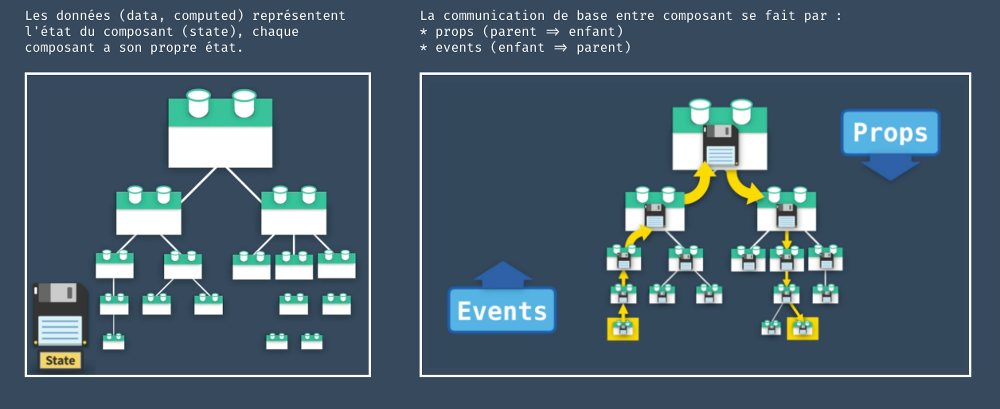
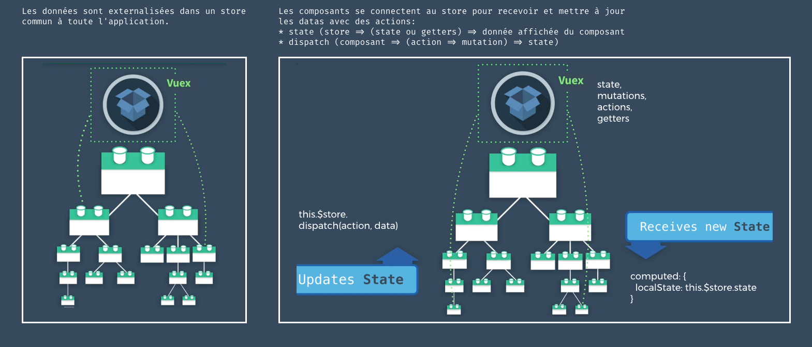

# Pourquoi utiliser un store ? et qu'est-ce qu'un store ?

Pinia est une bibliothèque de stockage (store) pour Vue, qui vous permet de partager un état entre tous les composants/pages.

Sans store, les données existent à l'intérieur d'un composant, mais sont isolées. Nous sommes obligés de faire communiquer les composants avec des `props` et des `$event` pour faire réagir un composant enfant ou un composant parent.



L'utilisation d'un store, permet d'extraire la logique du composant, et de la placer dans une "magazin de donnée", un store, externe au composant.
Celui-ci peut ainsi être appelé depuis n'importe où dans notre application, et ainsi maintenir un état commun à différents composants.



L'utilisation d'un store avec Pinia ou VueX est très utile :

- Support des outils de développement
- Une ligne de temps pour suivre les actions, les mutations
- Les stocks apparaissent dans les composants où ils sont utilisés
- Voyage dans le temps et débogage plus facile
- Remplacement à chaud des modules
- Modifiez vos magasins sans recharger votre page
- Conservez tout état existant pendant le développement
- Plugins : étendre les fonctionnalités de Pinia avec des plugins
- Support TypeScript ou autocomplétion pour les utilisateurs JS
- Support du rendu côté serveur

## Créer un store avec pinia

Pinia est une bibliothèque de gestion d'état pour les applications Vue.js. Elle fournit un moyen simple et efficace de gérer l'état global de votre application en utilisant des stores. Un store est un objet JavaScript qui contient l'état global de votre application, ainsi que des méthodes pour le modifier de manière réactive.

https://github.com/vuejs/pinia

Pour créer un store, il suffit de créer un nouveau fichier dans le dossier stores. Ce dossier existe car au moment de l'installation de notre projet, nous avons opté pour l'utilisation d'un store dans notre application.
Bien entendu il est toujours possible de l'ajouter après coup:

```sh
  npm i pinia
```

puis l'importer dans `src/main.js`

```js
  import { createApp } from 'vue'
  import { createPinia } from 'pinia' //<<<---ajout ici
  import App from './App.vue'

  const pinia = createPinia()  //<<<---ajout ici
  const app = createApp(App)

  app.use(pinia) //<<<---ajout ici
  app.mount('#app')
```

### Création d'un Store

Pour créer un store avec Pinia, vous devez utiliser la méthode `defineStore` et définir l'état initial de votre store ainsi que les mutations pour le modifier.

```javascript
import { defineStore } from 'pinia';

export const useCounterStore = defineStore('counter', {
  state: () => ({
    count: 0
  }),
  actions: {
    increment() {
      this.count++;
    },
    decrement() {
      this.count--;
    }
  }
});
```

## utiliser le store dans un composant

Pour ensuite pouvoir utiliser un store dans un ou plusieurs composants, il faut l'importer comme suit :

- on importe un ou plusieurs stores avec `...mapStores(store1, [[store2], store3, ...])`
- on importe l'état de chaque store avec qui représente les 'data' du store = `state` avec `...mapState(nomDuStore, ['var1', 'var2',...])`
- on importe les méthodes = `action` avec `...mapActions(nomDuStore, ['methode1', 'methode2'])`

```js
import { mapStores } from 'pinia'
import { useCounterStore } from '@/stores/counter'

export default defineComponent({
  computed: {
    // other computed properties
    // ...
    // gives access to this.counterStore and this.userStore
    ...mapStores(useCounterStore),
    // gives read access to this.count and this.double
    ...mapState(useCounterStore, ['count', 'double']),
  },
  methods: {
    // accéder à l'action du store this.increment()
    ...mapActions(useCounterStore, ['increment']),
  },
  mounted(){
    //exemple d'utilisation de la méthode au chargement du composant
    this.increment()
    console.log(this.count, this.double)
  }
})
```

## Pour aller plus loin

- [Pinia CheatSheet](./links/Pinia-Cheat-Sheet.pdf)
- https://pinia.vuejs.org/
- https://blog.logrocket.com/complex-vue-3-state-management-pinia/
- https://stackblitz.com/edit/vue-3-pinia-registration-login-example
