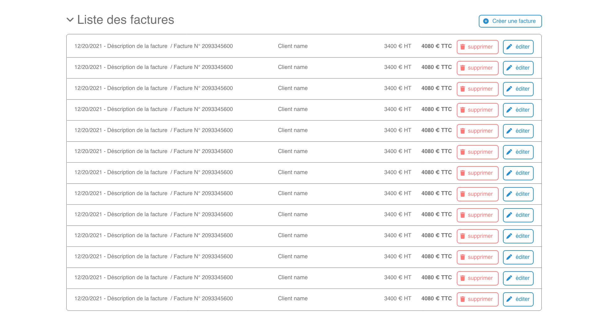

# Pas à pas du tp réalisé en cours

1. Intégrer bootstrap (version sass) dans le projet pour les styles
2. Créer la vue de base `App.vue`, et intégrer le code HTML du rendu de la vue, selon la capture d'écran ci-après
3. Dans le tableau des factures, transformer chaque ligne du tableau en un composant externe (par facture), nommé `BillTableRow.vue`
4. Intégrer les données du tableau avec une variables tableau `bills`, qui contiendra des objets `bill` (données exemple fournies ci-après)
    - L'affichage des lignes du tableau doit être généré avec une boucle `v-for`, (ne pas oublier la `:key`)
    - Injecter les données dans chaque composant à l'aide d'une **props** `bill` depuis `App.vue` dans les composants enfants `BillTableRow.vue`
5. Rendre les boutons fonctionnels avec des appels de fonctions, certains boutons sont à l'intérieur du composant ligne de tabeau
    - Le bouton Créer une facture doit appeler une fonction `createBill` dans `App.vue` qui pousse une nouvelle facture dans le tableau `bills`
    - Les fonctions du composants `BillTableRow.vue` doivent émettre un événement custom que vous nommerez `onEditBill`et `onDeleteBill`
    - vous devez donc écouter les événements depuis le composant parent `App.vue`, quand l'événement est emit, transmettre le numéro de la facture à modifier ou supprimer depuis la fonction du composant enfant, vers une fonction du composant parent
    - Dans le composant parent, créer une fonction `editBill` qui prend en paramètre le numéro de la facture à modifier et une fonction `deleteBill` qui prend en paramètre le numéro de la facture à supprimer
    - Créer la logique qui permet de supprimer ou d'éditer une facture dans le composant parent
6. Édition d'une facture : Dans `App.vue`, sous le tableau des factures, créer un composant d'édition d'une facture `EditBillForm` dans lequel on injectera une **props** `bill`, qui contiendra les données de la facture à modifier. À cet effet, créer une nouvelle variable, qui permettra de stocker temporairement les données de la facture en cours d'édition `currentBill`
    - Ajouter une variable `currentBill` aux `data` de l'app, créer une fonction editBill qui prendra en paramètre l'id d'une facture et qui permettra d'instantier la variable temporaire `currentBill` avec les données de la factur en cours d'édition (récupérer cette donnée dans le tableau des `bills` grâce à l'id passé en paramètre)
    - Déclencher l'appel de cette fonction lorsque l'événement `onEditBill` est émit depuis le composant enfant `BillTableRow.vue`
    - Dans le composant `EditBillForm`, créer un formulaire avec les champs qui correspondent aux données d'une facture (voir le modèle de donéne de la facture ci-après)
    - Dans ce même composant, récupérer la props pour en faire une variable locale `form`, au chargement du composant, remplir la variable avec le jeux de donnée de la prop `bill`
    - Créer tous les champs input, select, textarea, checkbox en fonction des données à éditer, créer également 2 boutons pour permettre d'annuler la saisie ou d'enregistrer le formulaire
    - Créer les emetteurs d'événement qui permette de communiquer ces actions au composant parent, `onCancel` et `onSave`
    - Dans le composant parent `App.vue`, créer les fonctions et la logique d'édition d'une facture, d'affichage du formulaire, et d'annulation de l'édition
    - Lorsqu'on enregistre, on doit récupérer dans le parent, la valeur de `form` et pousser remplacer la donnée de la bill en cours d'édition par le nouveau formulaire, créer une fonction dans le parent pour accomplir cette logique dans une fonction `saveBill`
    - Lorsqu'on annule (événement `onCancel` du composant de formulaire), on doit effacer la valeur de `currentBill` dans le parent et masquer le formulaire d'édition (avec un `v-if` sur le composant)

## annexe 1

Données du tableau bills:

```js
  const bills = [
    {
      id: 1,
      billnum: 209345600,
      description: 'Création de site internet et hébergement',
      date: '08/03/2023',
      client: {
        idclient: 1,
        firstName: 'Marc',
        lastName: 'Scout',
        companyName: 'Lumon Industries'
      },
      prestations: [
        {
          description: 'Etude graphique UX',
          qty: 2,
          price: 450.00
        },
        {
          description: 'Création d’un site Wordpress',
          qty: 5,
          price: 450.00
        },
        {
          description: 'Hébergement annuel',
          qty: 1,
          price: 250.00
        },
      ],
      discount: 0.00,
      paid: 0.00,
      totalHT: 3400,
      tva: 20,
      totalTTC: 4080
    },
    //ajouter des autres bills
  ]
```

## annexe 2

Capture d'écran de l'application à réaliser :

