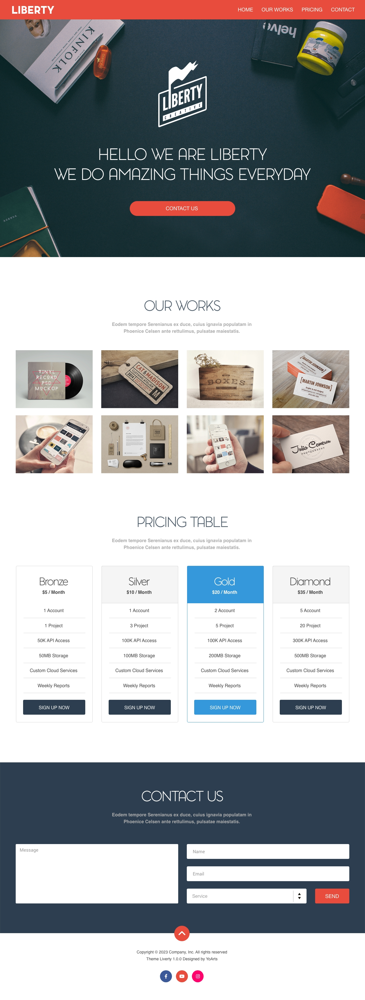

# LIBERTY

Exercice noté Liberty: Reproduire au format HTML/CSS la maquette jointe à ces instruction `liberty-home-todo.jpg`. Rendu du devoir: compressez l'ensemble de votre projet dans une archive .zip et renommez cette archive avec votre prenom-nom.zip. Tout devoir rendu après la date limite est non-valide et sera noté 0.

## Instructions générales

- L'utilisation de framework CSS est autorisée pour réaliser ce devoir.
- La mise en page s'inscrit soit dans un conteneur 1170px de large (conteneur fixe), centré dans le document HTML (marges auto), soit dans la largeur totale de la fenêtre (conteneur fluide).
- Le responsive design est optionnel.
- Rendre les liens de navigation et du pied de page actifs en utilisant des ancres qui permettent de naviguer dans les sections de la page (navigation + retour haut de page)
- Les images et fonts à utiliser sont disponible dans le dossier de l'exercice.

## Couleurs

- Rouge: #E74C3C
- Gris-bleu (texte titres foncé): #4D5C6B
- Gris (texte sous les titre): #ABABAB
- Gris Price table text: #444444
- Gris price table border: #D5D5D5
- Gris-bleu-foncé bouton price table + fond formulaire contact: #2C3E50
- Bleu bouton+bordure price table: #3498DB
- Gris clair price table (bg header): #D5D5D5

## Typographies

- Titres : Pontiac light
- Logo : Pontiac Black
- Body: Arial/Helvetica

## Header

- conteneur fluide, largeur totale de la fenêtre
- hauteur: 68px
- padding: 11px 24px
- logo: Pontiac Black, 36px, approche -20, #fff
- navigation: Arial/Helvetica, 18px, #fff

## Hero

- conteneur fluide, largeur totale de la fenêtre
- hauteur min: 832px, hauteur max: 100vh - 68px
- titre: Pontiac light 54px/70px approche -50, #fff
- bouton: Arial/Helvetica, 18px, #fff
- marges entre les logo, titre et bouton: 60px
- centrer les éléments logo + titre + bouton dans le cadre de l'image

## Our works

- conteneur fixe, centré en largeur dans la fenêtre
- espace avant la section de 120px
- titre : Pontiac light 48px/62px approche -70, #4D5C6B
- texte sous le titre: Arial/Helvetica bold, 18px, #ABABAB
- Les image doivent s'inscrivent dans la largeur du conteneur, largeur de vignette 270px, espace entre les - vignettes auto.

## Pricing Table

- conteneur fixe, centré en largeur dans la fenêtre
- espace avant la section de 120px
- titre : Pontiac light 48px/62px approche -70, #4D5C6B
- texte sous le titre: Arial/Helvetica bold, 18px, #ABABAB
- Les colonnes s'inscrivent dans la largeur du conteneur, largeur de colonne 270px, espace entre les - colonnes auto.
- les couleurs sont précisées en haut de document
- Titre colonne: Pontiac light 36px/47px approche -70, #444444
- sous-titre de colonne: Arial/Helvetica bold, 16px/24px, #444444
- texte de colonne : Arial/Helvetica, 16px/24, #444444
- texte de bouton : Arial/Helvetica, 16px, #444444

## Contact us

- arrière-plan en conteneur fluide qui occupe toute la largeur de la fenêtre, mais la composition s'inscrit dans un conteneur fixe, centré en largeur dans la largeur de la fenêtre
- espace avant la section de 120px
- background: #2C3E50
- titre : Pontiac light 48px/62px approche -70, #fff
- texte sous le titre: Arial/Helvetica bold, 18px, #ABABAB
- Texte de formulaire: 14px/18px gris: #ABABAB
- Envoi du formulaire en POST, page de traitement : contact.php

## Footer

- conteneur fixe, centré en largeur dans la fenêtre
- Texte: Arial/Helvetica, 14px/24px, #444444

## Ajouter de l'interaction sur les boutons

- Survol des liens de navigation: texte souligné
- Survol des boutons rouges: background #FF6858
- Survol des boutons bleu foncé: background #3498DB
- Survol du boutons bleu clair (pricing table): background #48ADF0
- Focus des champs de formulaire: bordure #3498DB, texte: #444444

## Barème de notation

- Propreté du code, indentation et commentaires: 2 pt
- Rendu fidèle à la maquette et respect des consignes de ce document: 3pt
- Code / rendu du header: 2pt
- Code / rendu du hero: 3pt
- Code / rendu de la section Our Work: 3pt
- Code / rendu de la section Price table: 3pt
- Code / rendu de la section Contact: 2pt
- Configuration du formulaire de contact, ajout des labels, des names, ids... 2pt
- Points bonus: responsive design : 4 points.

Total noté sur 20pts (possibilité d'obtenir 24pts avec le bonus).
