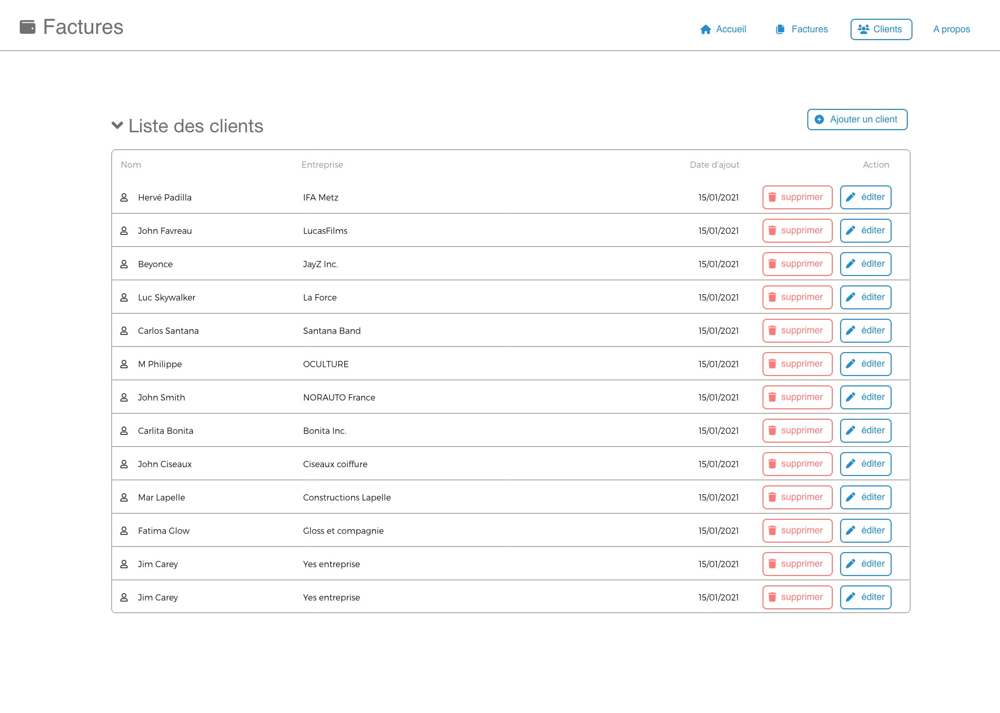
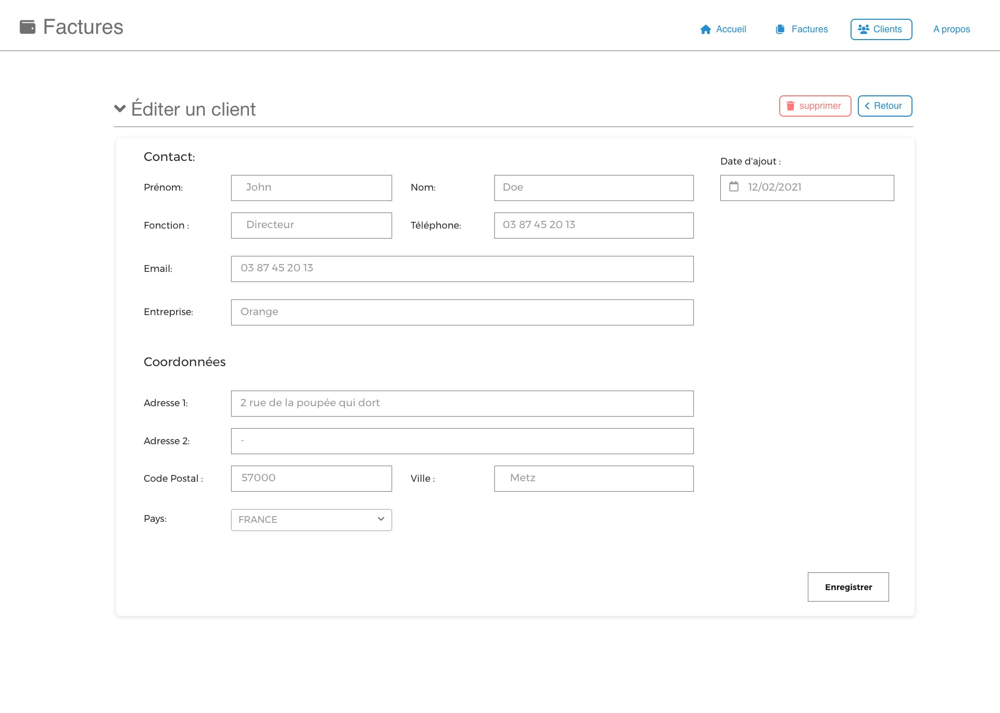

# VueJS / NodeJS

## Objectifs pédagogiques

* frontend en VueJS capable de recevoir des données, de les afficher, de les modifier, de les supprimer, avec utilisation du store pinia, et de vue-router.
* backend : application Node.js basé soit sur une base MongoDB (me fournir les identifiants), soit sur la lecture/écriture d'un fichier JSON.
* Documenter et tester l'API avec le plugin VSCode ThunderClient

## Evaluation des connaissances : Exercice pratique

> Votre exercice consite à réaliser les vues manquantes de l'application réalisée en cours, telle que décrites sur les captures d'écrans jointes et la description détaillée qui suit.

En partant du dernier état du dépot du projet achevé ensemble (dossier `TP/10-ajout-du-backend/`), Vous devrez compléter l'application en ajoutant **la gestion des clients** dans l'application.
Vous devrez pour cela respecter l'architecture du projet déjà mise en place (utilisation du store, utilisation des routes avec vue-router, architecture de l'api avec nodejs...).

## UX des écrans à réaliser

## Travail à rendre

### FRONTEND (Vuejs)

* Créer la vue de liste des clients (capture d'écran jointe pour le layout)
* Créer la vue d'édition/modification d'un client
* Créer un nouveau module du store `client` qui contiendra la logique et l'état pour cette ressource
* Intégrer le store dans les vues de l'application (intégration du state et des actions dans la vue d'édition et de liste des clients)
* EN BONUS (non obligatoire): Intégrer la liste réelle des clients le select situé dans l'écran de création/modification d'une facture, afin d'établire une relation entre les factures et les clients

### BACKEND (Nodejs/MongoDB ou bien édition de fichiers JSON en fonction de ce que l'on a vu en cours)
  
* Créer un noveau modèle de donnée pour un client (fichier DB/clients.json si en JSON)
* Créer des nouvelles routes d'api pour gérer la nouvelle ressource côté backend
* Intégrer le CRUD pour la ressource `client` :

    1. la route `POST '/clients/'` pour créer un client en BDD (ou fichier JSON)
    2. la route `PATCH '/clients/:id'` pour modifier un client en BDD (ou fichier JSON)
    3. la route `GET '/clients/'` pour lister tous les clients de la BDD (ou fichier JSON)
    4. la route `GET '/clients/:id'` pour obtenir les données d'un client en BDD (ou fichier JSON) en fonction de son ID
    5. la route `DELETE 'clients/:id'`  pour supprimer un client en BDD (ou fichier JSON) en fonction de son ID

L'API créé sera testée avec le plugin ThunderClient de VSCode, tel que vu en cours. Vous ajouterez une collection de routes et les échantillons de données nécessaires aux tests de votre API.

### Objectif Bonus

En **objectif bonus**, (et non obligatoire), vous pouvez terminer l'intégration de la vue du Dashboard en incluant un composant de graphique, ainsi que la liste des 10 derniers clients selon la capture d'écran ci-dessous.

**Des points bonus seront attribués aux stagiaires ayant complété les objectifs bonus.**

### Rendu de l'exercice

Pour rendre votre projet, vous devrez me donner accès au dépôt GIT du code de votre exercice finalisé, lien du dépôt à envoyer sur la plateforme Classroom.
En dernier recours, vous pouvez également me faire parvenir une archive zip de votre projet sur cla plateforme classroom (¡¡¡ sans les `node_modules` !!! ), attention à bien mettre votre `nom-prenom.zip` comme nom de l'archive zip.

> Afin de pouvoir reconnaître vos pseudos, n'oubliez pas de **mentionner votre nom complet** (dans le readme du projet, ou sur votre compte GitHub).
